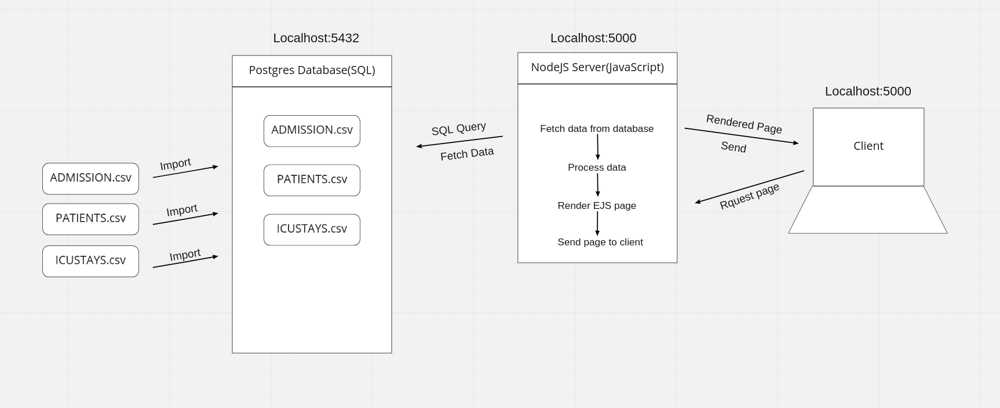

# README

This tutorial introduced a new data visulization package called Apache Echarts

In the following tutorial, we will demonstrate how to use Apache Echarts to visulize MIMIC dataset.

## Table of Content
1. Set up the environment ( Postgres, NodeJS)
    * Postgres installation
    * NodeJS installation
2. Import MIMIC csv dataset to postgres
3. Setup the Node server, and connect it with Postgers database
4. Using EJS to render 

## Design

